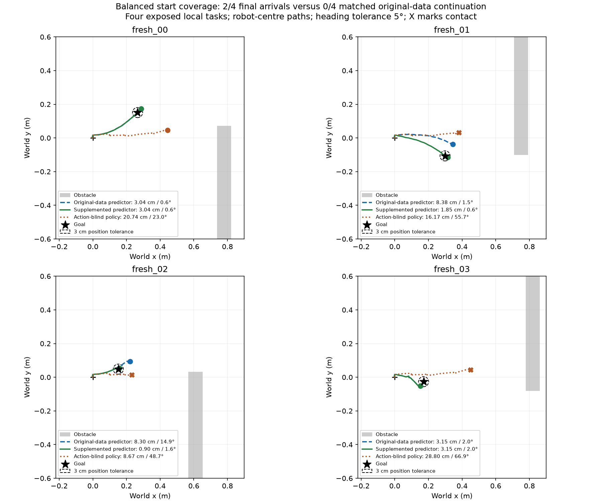

# Balanced start coverage: completed closed-loop comparison

The supplemented action-conditioned predictor achieved **2/4 final arrivals
with no contacts**, versus **0/4 with no contacts** for matched original-data
continuation. The shared action-blind policy achieved **0/4 with three contacts**.
This is a local closed-loop benefit from added training coverage at fixed
optimization budget, on four exposed development tasks. It is not an
independent maze-generalisation result or a JEPA encoder-objective ablation.

| Controller | Final arrivals | Transient visits | Contacts | False arrival latches | Mean final XY (cm) | Mean final heading (degrees) |
|---|---:|---:|---:|---:|---:|---:|
| Original-data continuation, action input | 0/4 | 1/4 | 0 | 1 | 5.719 | 4.752 |
| Supplemented continuation, action input | 2/4 | 3/4 | 0 | 1 | 2.235 | 1.193 |
| Shared action-blind policy | 0/4 | 0/4 | 3 | 1 | 18.596 | 48.551 |

The contact-truncated action-blind runs have shorter exposure; their mean errors
are descriptive, not fixed-duration performance estimates.

| Task | Predictor/policy | Final XY (cm) | Heading (degrees) | Final success | Contact |
|---|---|---:|---:|---|---|
| fresh_00, left | Original data | 3.040 | 0.640 | No | No |
| fresh_00, left | Supplemented | 3.040 | 0.640 | No | No |
| fresh_00, left | Action blind | 20.745 | 22.992 | No | No |
| fresh_01, right | Original data | 8.380 | 1.474 | No | No |
| fresh_01, right | Supplemented | 1.853 | 0.585 | Yes | No |
| fresh_01, right | Action blind | 16.165 | 55.657 | No | Yes |
| fresh_02, left | Original data | 8.302 | 14.934 | No | No |
| fresh_02, left | Supplemented | 0.896 | 1.588 | Yes | No |
| fresh_02, left | Action blind | 8.671 | 48.675 | No | Yes |
| fresh_03, right | Original data | 3.153 | 1.961 | No | No |
| fresh_03, right | Supplemented | 3.153 | 1.961 | No | No |
| fresh_03, right | Action blind | 28.803 | 66.878 | No | Yes |

The criterion remains completed budget, no disallowed contact, final position
within 3 cm and relative heading within 5 degrees. No threshold, checkpoint,
goal metric, arrival readout or action bank was changed after these outcomes.

On fresh_01, original-data continuation starts forward and then executes three
right arcs, finishing 8.38 cm from the goal. Supplemented training selects three
right arcs followed by forward, reaching the goal before the same arrival latch
holds. The fixed six-action branch diagnostic had predicted this improvement:
added coverage changed the initial ranking from forward to the physically best
right arc, with 21.3% lower dense prediction error.

On fresh_02, original-data continuation selects three left arcs and two left
turns before holding outside the goal. Supplemented training selects two left
arcs and two left turns, then latches at an actual 0.31-cm position error and
finishes within tolerance. Thus the observed benefit is not confined to the
single right-opening diagnostic that motivated the training-coverage check.

Both action predictors behave identically on the two remaining tasks. Task 00
correctly latches at 0.42 cm, then drifts to 3.040 cm. Task 03 falsely latches
at 4.24 cm, then finishes at 3.153 cm. These remain failures under the fixed
criterion; do not loosen it or discard these runs. The common stopping
mechanism limits final-arrival reliability independently of the corrected
approach decisions.

Twelve trials were fixed while training was still running. Worker sessions
62524 and 93898 completed six native cases each, both exit 0. Reader 53681
exited 0 and verified all terminal results, controller identities, matching
initial eleven RGB frames, action-blind six-way cost ties, and latch behavior.
Both blind predictor weights were evaluated offline; online action selection
is the same seeded uniform-tie policy regardless of their weights, so it was
executed once per task. This does not create eight independent blind trials.

The previous parent predictor with the same cross-trajectory metric had 0/4
arrivals and one contact. Direct visual feedback had 0/4 and one contact.
Those are reused historical references, not new trials; the matched
original-data continuation is the primary control for the added data.

All failures and successes retain RGB, physics, applied commands and sensor
timing. Depth was omitted prospectively because this controller does not use
it. The two artifact roots split recording across workspace and root disks.
Remaining free space after the batch was approximately 529/580 MiB; further
native recording needs a storage decision before launch.

The new examples use only training geometries, but these four evaluation
tasks were already exposed and informed diagnosis. One fit seed, four related
layouts and deterministic repeated dynamics limit generality. The encoder is
frozen pretrained V-JEPA; the result supports this action-conditioned predictor
and its training coverage, not a causal claim about JEPA representation learning.
Full-maze exploration, memory and backtracking with this dense model, stronger
independent validation, real-time sensing and hardware evidence remain open.

Next retain the supplemented model as a candidate for independent prospective
comparison; do not declare the navigation goal complete or refit the same goal
head by default. Full-maze integration must explicitly address the 500-ms
visual-endpoint versus existing 100-ms motion-trajectory interface and
collision scoring. These local successes do not solve those requirements.

Result: `go2_balanced_start_goal_pilot_result_2026-09-17.json`.
Design and plan: `go2_balanced_start_goal_pilot_design_2026-09-17.json`,
`go2_balanced_start_goal_pilot_plan_2026-09-17.json`.
Predictor fit/evaluation: `go2_balanced_start_predictor_2026-09-17.md`.
