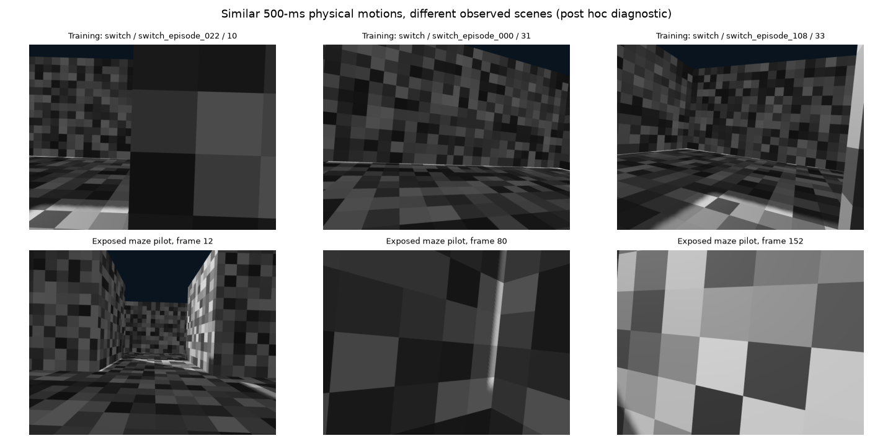

# Targeted motion-readout experiment

The first dense-model maze pilot exposed a physical-readout problem: even actual
future images produced 44.30 mm XY RMSE and 8.32 degrees yaw RMSE at its trained
500-ms horizon. The action-conditioned predictor alone cannot explain this.
The unchanged full navigation run remains active; this experiment does not
alter its model or controller.

The motion-coverage check found 29/35 matched pilot windows within all three
training-label ranges. Nearest training-motion distances, in training standard
deviations, have median 0.0403 and maximum 0.3448. These are not predominantly new
motion magnitudes. This does not prove visual coverage: the maze presents
different corridor and close-wall views.



Coverage record: `go2_dense_horizon_pilot_training_coverage_2026-09-18.json`.
The original training population has 3518 windows from 138 recordings in two
training clusters. No role was changed by the diagnostic.

## Fixed intervention

The new readout forms a 192-by-192 current/future normalized feature correlation
matrix, subtracts current/current correlations, and fits a linear map to body
XY/yaw without an intercept. Identical image pairs therefore produce zero
motion. Absolute current-image features and action commands are not regression
inputs. The encoder and action-conditioned predictors remain frozen.

- 546 windows: up to four equally spaced admitted 500-ms windows per original
  training recording, selected by time index rather than labels or errors.
  No pilot or full-maze images enter fitting.
- One fixed ridge penalty, 0.1; training-only feature and target scales.
  No architecture or regularization search.
- 110,592 coefficients versus the original head's 852,515 parameters. Data and
  capacities differ; this is a practical readout intervention, not a matched
  encoder-objective comparison.
- 1054 RGB paths; about 0.83 GB of pooled features in RAM, not retained on disk.
- CPU float32 on cores 4–7, separate from the GPU/navigation job's cores
  8–15/24–31. Measured encoding is about 1.4 s/image: approximately 25 minutes
  plus the small regression fit.

Plan: `go2_correlation_motion_readout_plan_2026-09-18.json`.
Output: `.generated/navigation_development_artifacts_v1/go2_correlation_motion_readout_v1_attempt_001/`.
Its progress and terminal artifacts are retained with the final checkpoint.

The fit has now completed with owner exit 0 in **1459.3 seconds (24.3 minutes)**.
Training error is **5.48 mm XY / 0.57 degrees yaw** on its 546 selected windows.
These are in-sample fit metrics, not transfer or navigation results. The final
checkpoint SHA-256 is
`52cd053c6535672905e7272ba22fd015e04aad3df21cf91e91489fe7de7c89fd`.
No encoder or predictor weights changed, and no feature cache was retained.
The queued exposed-pilot evaluation started automatically after fit completion.

## Prepared evaluation

The evaluator uses the same 35 completed pilot windows at 300/500/700 ms. It
compares both readouts on actual future features, action-conditioned forecasts
and action-blind forecasts. Zero motion and subtraction of the original head's
current/current prediction are included. Errors over the 300–700-ms planning
interval are separate from absolute endpoint errors.

After terminal fit completion:

An evaluator has now been queued behind the verified training owner PID 85549
(creation time 1789694334.98). It waits for that process to exit, checks the
completed fit result, and invokes the command below on cores 4–7. Do not launch
a duplicate while that queued evaluator is live. The evaluation directory is
created exclusively; existing output is preserved.

```sh
PYTHONDONTWRITEBYTECODE=1 PYTHONPATH=.:lewm_genesis:lewm_worlds OMP_NUM_THREADS=4 MKL_NUM_THREADS=4 OPENBLAS_NUM_THREADS=1 taskset -c 4-7 .generated/venvs/genesis_rocm_0_4_6_v1/bin/python scripts/evaluate_go2_correlation_motion_readout_development.py
```

This is an exposed diagnostic on selected turn/hold windows. Any component
improvement still needs actual navigation and matched controls; it cannot
establish translation, independent maze success or a JEPA-training advantage.
The four prospective mazes remain untouched.

## Completed exposed-pilot result: do not promote

The queued evaluation completed with owner exit 0 in 283.4 seconds. All 35 fixed
windows were evaluated; original 500-ms predictions were reproduced within the
2e-5 numerical tolerance. No navigation model was changed.

| Forecast/readout | 500-ms XY RMSE (mm) | 500-ms yaw RMSE (degrees) | 300–700-ms XY increment RMSE (mm) | 300–700-ms yaw increment RMSE (degrees) |
|---|---:|---:|---:|---:|
| Original head, action-conditioned prediction | 37.16 | 7.23 | 14.62 | 6.46 |
| Correlation head, action-conditioned prediction | 37.74 | 9.47 | 21.15 | 6.71 |
| Original head, actual future image | 44.30 | 8.32 | 15.80 | 9.20 |
| Correlation head, actual future image | 38.54 | 8.28 | 25.84 | 8.78 |
| Original head, action-blind prediction | 29.98 | 7.38 | 13.66 | 7.10 |
| Correlation head, action-blind prediction | 35.18 | 8.69 | 12.94 | 6.78 |
| Zero motion | 6.76 | 11.64 | 5.46 | 9.64 |

The correlation readout's modest oracle XY improvement at 500 ms does not carry
through to the planner's interval or predicted-feature decoding. It is not
selected for navigation. Subtracting the original head's current/current output
leaves the 300–700-ms increment errors unchanged, as expected when a shared bias
cancels. These windows are mostly turns: the zero-motion XY score does not
establish a useful navigation controller.

Full results: `go2_correlation_motion_readout_v1_attempt_001/pilot_evaluation/result.json`
under the workspace artifact base. Preserve the checkpoint and negative result.
No further readout variation is justified by this experiment alone. The next
priority is the completed full navigation outcome and a matched reactive run,
followed by diagnosis of the actual stalled decisions. Stronger claims about
the encoder, predictor or a revised planning objective require separate evidence.
