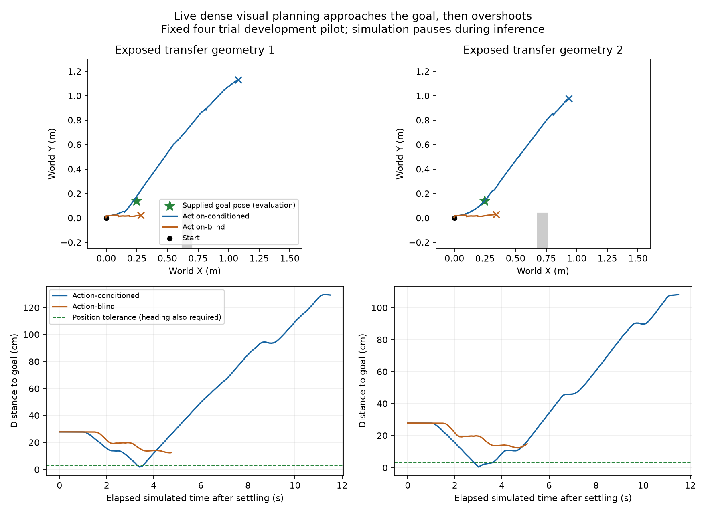

# Prospective native dense visual-goal control pilot

Status: **COMPLETE, all four attempt-002 trials terminal; reliable goal staying
not achieved**. Tool sessions 83495, 24008, 81792 and 65777 all exited 0. Both
action-model runs completed the fixed budget. Both blind runs terminated at
actual disallowed contact. No pilot process remains live.

Attempt 001 terminated with an interface exception in both cases: float32
serialization turned the requested forward value 0.20 into 0.20000000298,
outside the inherited session's strict 0.20 bound. Case 0 made five decisions
(four blocks executed) and case 1 two decisions (one block executed). Their
complete partial recordings, failure logs, source snapshots and plan remain
in attempt 001; cases 2/3 were never launched there. Neither is a completed
scientific trial. Attempt 002 preserves canonical requested-command precision.
Its float32 applied tapes were verified exactly unchanged for all six actions
from zero, left and right previous-command states. No weights, costs, goals,
candidate actions, seeds or budgets changed.

## Prospective results

Each goal starts 27.75 cm and 50.74 degrees from the settled robot. Initial RGB
matches exactly throughout the 11-frame quiet prefix within each pair.

| Geometry | Model | Closest XY cm | Maximum consecutive frames within XY/yaw tolerance | Final XY cm | Final yaw degrees | Contact |
|---|---|---:|---:|---:|---:|---|
| cluster 02 | Action-conditioned | 1.85 | 2 | 129.28 | 19.26 | No |
| cluster 02 | Action-blind | 12.23 | 0 | 12.41 | 48.23 | Yes |
| cluster 03 | Action-conditioned | 0.39 | 7 | 108.14 | 3.28 | No |
| cluster 03 | Action-blind | 12.23 | 0 | 14.78 | 47.41 | Yes |

The predeclared three-frame visit criterion passes in 1/2 action runs and 0/2
blind runs. **Neither action run ends at the goal: both continue past it.**
The criterion is a transient visit, not a stop or stable arrival. Keep that
distinction alongside the original `goal_reached` field; do not promote this
pilot to reliable navigation. Both action runs avoid contact; both blind runs
hit the obstruction. There are only two related local tasks and a weak blind
control, so this is not evidence of superiority over a competent reactive policy.

At tick 35 of cluster 02, the robot is 2.25 cm and 2.38 degrees from the goal.
The predictor nevertheless prefers forward (predicted goal cost 0.3430) over
hold (0.4398). Measured goal distance then increases. This directly identifies
the decision failure; it does not yet establish whether the forecast ranking
or the image-goal cost is responsible. The goal image was captured during gait,
and feature distance need not be monotonic in planar position/heading error.

Cluster 03 briefly chooses hold at tick 30, when XY error is 0.39 cm, yaw error
0.14 degrees and observed goal-feature MSE 0.0410. After that block it remains
within the physical tolerance (2.70 cm, 1.83 degrees), but observed feature MSE
has risen to 0.4510 and the next choice is forward. Thus stopping is available
in the action bank; the issue includes recognizing and maintaining arrival.
Tick 35 in each action-model run is the concrete departure for the next matched
alternative diagnostic, selected post hoc to investigate the live failure.

Action-model factual feature MSE on its own realized windows is 0.3564/0.3210
versus same-window persistence 0.5802/0.5258. These prediction gains coexist
with the overshoot. Cross-arm factual MSE is not a matched comparison because
the realized trajectories differ. All 40 completed action-model blocks passed
the observed-command versus forecast-command check.

Each action trial took about 41 seconds, and each contact-terminated blind trial
about 22 seconds. Action-model inference plus encoding averaged about 0.63 s
per 0.5 s simulated decision interval under the paired workload. Simulation
paused for computation; real-time execution is not established.

Next isolate the failure with matched native alternatives at a near-goal
departure: replay the exact causal prefix, execute each candidate once, and
compare predicted goal-cost ranking with actual successor-image ranking and
physical goal errors. This is a diagnostic, not a fixed-tape navigation result.
Use it to decide whether to improve prediction of braking or the visual cost;
do not add a simulator-pose stop, tune an arbitrary transfer threshold, or repeat
a maze sweep without addressing the observed failure.

Result: `go2_dense_visual_goal_pilot_result_2026-09-17.json`.
Reader: `scripts/read_go2_dense_visual_goal_pilot_development.py`.

Follow-up diagnostic is complete: `go2_dense_goal_overshoot_2026-09-17.md`.
All 12 matched alternatives reproduced the original prefix exactly. Even
actual successor images select forward under raw feature MSE in both cases,
despite physically better braking. The next intervention is a training-only
goal-distance function with encoder and predictor fixed, followed by another
prospective comparison if the cost supports correct physical decisions.

The preceding retrospective diagnostic justified a direct visual cost, while
the motion decoder failed to transfer adequately. This experiment connects the
unchanged adapted dense predictor to actual native execution. It does not use
the unrelated eight-horizon motion controller or give the controller target pose.

- Two already exposed geometry-transfer layouts, excluded from adaptation
  training: the geometries of `family_episode_026` and `family_episode_003`.
- Supplied goals are native RGB frame 23 from opening-side arc episodes
  `family_episode_010` and `family_episode_089`, respectively. These match each
  live geometry and appearance. Goals are externally supplied task images,
  not automatically discovered subgoals or unseen future camera inputs.
- Two matched conditions: adapted action predictor and its matched
  no-future-action predictor. Same encoder, action bank, past-control history,
  goal, observation timing, physics and execution budget. Exact cost ties use
  a fixed seeded uniform draw. The blind model forecasts once and broadcasts
  the result so GPU roundoff cannot invent action sensitivity.
- Ten quiet command ticks provide three genuine images at 500-ms spacing.
  Then 20 decisions select among six 500-ms sustained primitive commands.
  Reacquire actual RGB after each block. Reconstruct candidate commands through
  the platform limiter from causal applied-command history; verify the selected
  trajectory against observed applied commands at the next decision.
- Minimum normalized dense-feature MSE to the goal chooses the command. No
  learned physical readout, supplied motion labels, map, depth or native pose
  enters selection. Existing native body/contact limits terminate unsafe trials.
- Five final quiet ticks follow the fixed budget. Evaluation happens afterward:
  contact-free arrival within 3 cm and 5 degrees for three consecutive 10-Hz
  camera frames. Report final errors, minimum XY error, physical stops and
  budget completion as well as this criterion. No oracle-success early stop.

The in-memory image preprocessing exactly matched the existing encoder path
on a recorded native image. A recorded-packet test exercised three observations
and a six-candidate live selection, including control-clock checks and limiter
reconstruction; first selection took 0.336 seconds. This is an interface check,
not a prospective outcome or real-time qualification.

Before launch: 72 GiB available RAM, 4.0 GiB free output storage, R9700 31.86 GiB
VRAM, no competing compute process. Two independent native processes use CPU
groups 4-7 and 8-11 and share the GPU. Every case owns a distinct output folder.
The existing native collection established compatible concurrent simulation;
observe throughput and memory for the new combined workload. Stop before a new
block if output free space falls below 512 MiB. Retain native recordings and all
failures; no dense feature cache is written to disk.

Physics pauses during inference. This is a local image-goal development pilot,
not full-maze navigation, an untouched benchmark, a strong reactive comparison,
or evidence isolating the JEPA training objective. Full exploration, routing,
memory, backtracking, prospective maze comparisons and hardware/timing evidence
remain part of the active goal.

Current plan: `go2_dense_visual_goal_pilot_attempt_002_plan_2026-09-17.json`.
Preserved first plan: `go2_dense_visual_goal_pilot_plan_2026-09-17.json`.
Sources: `lewm/dense_visual_goal_control_development.py` and
`scripts/run_go2_dense_visual_goal_pilot_development.py`.
Current output: `/mnt/steam_drive/LeWMQuad-v3/navigation_development_artifacts_v1/go2_dense_visual_goal_pilot_v1_attempt_002/`.
