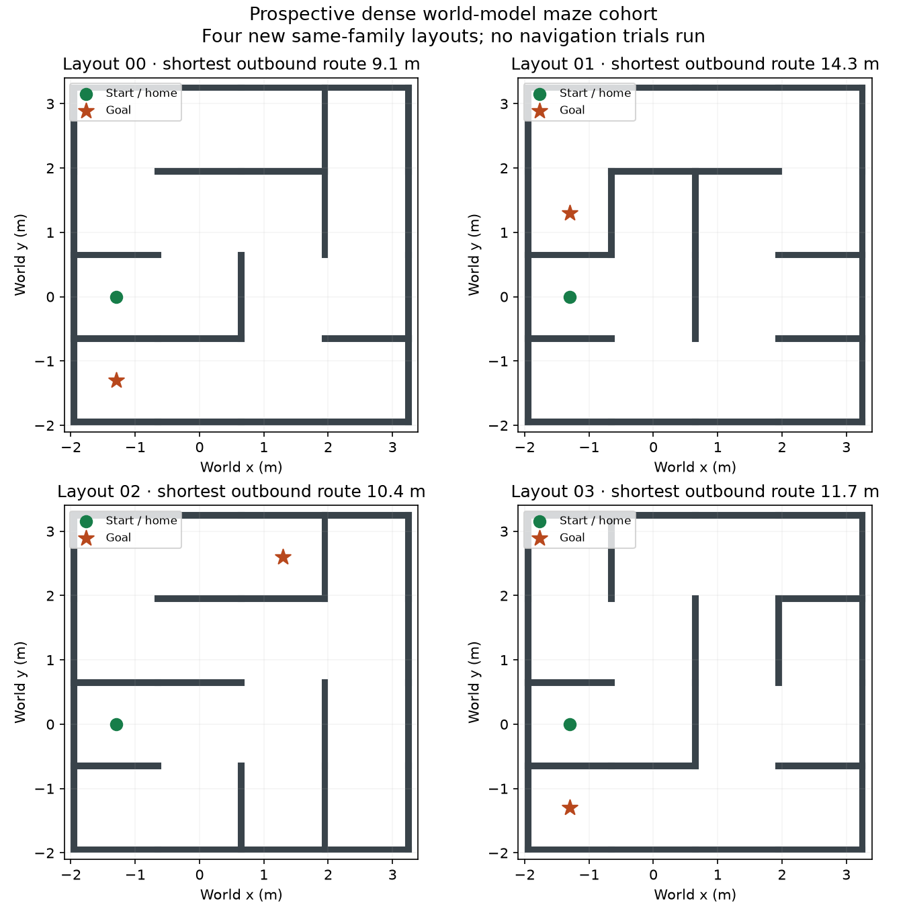

# Prospective maze layouts for the dense world model

Four same-family maze layouts were selected before the new dense predictor's
fit completed and before any navigation outcomes on them. They have distinct
abstract topologies and grid embeddings, disjoint from the explicit 105-layout
development registry. This is not a claim about every possible historical
environment or a sealed final benchmark. These layouts have not been used for
training, controller tuning or native execution.

Construction seed: 2026091803. The generator accepted candidates 0, 2, 3 and 4
using the existing structural criteria. The registry contains 104 distinct
abstract topology groups. All four new layouts are connected sixteen-cell
trees with fifteen passages; cell pitch is 1.3 m. Geometry and routes remain
simulator/evaluator inputs. The navigation controller receives the public goal
and its own observations, not the maze map or shortest route.

| Layout | Shortest outbound route | Native execution |
|---|---:|---|
| 00 | 9.1 m | Not run |
| 01 | 14.3 m | Not run |
| 02 | 10.4 m | Not run |
| 03 | 11.7 m | Not run |

The next comparison should include the dense action-conditioned planner,
the matched action-blind treatment, the established command-history baseline
and reactive feedback, with shared perception, routing and physical arrival
criteria. This document fixes the layouts, not a completed execution protocol.
The model interface and measured inference costs must be established before
binding final runtime settings and the execution order. Do not imply the old
300-ms deadline is met by the larger model. Any untimed simulation treatment
must be explicit and shared across the comparison; it cannot support a
real-time or hardware claim. Sensor realism remains at the declared simulation
level while the immediate work targets the world-model scientific questions.

The full goal still requires independent closed-loop goal/home arrival,
exploration and backtracking evidence, matched planning and memory controls,
and a clear distinction between a frozen V-JEPA encoder's usefulness and a
causal benefit from JEPA representation learning. These new layouts alone
establish none of those outcomes.

Source: `lewm/dense_world_model_maze_layouts_development.py`.
Inventory: `go2_dense_world_model_maze_inventory_2026-09-18.json`.
Construction session 89276 exited 0. The figure was visually inspected.
