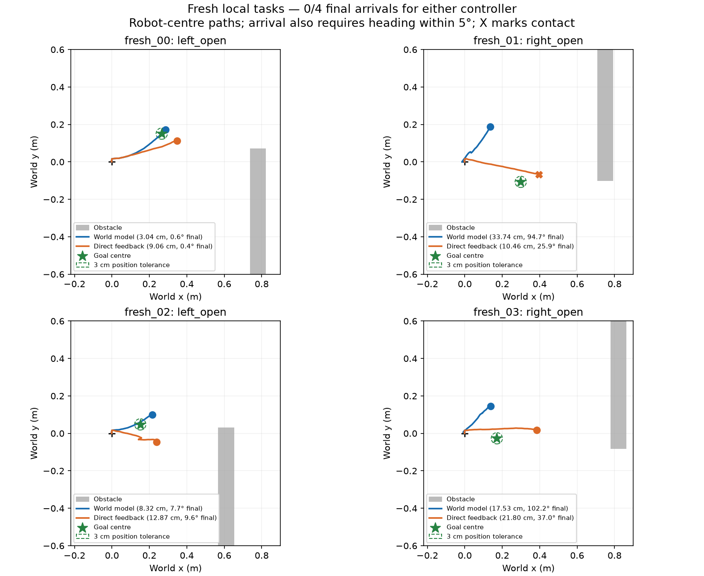

# Frozen controllers on fresh local layouts and goal images

Status: **COMPLETE: 0/4 final arrivals for either controller**. All eight
native processes exited 0, including the contact-terminated feedback trial.
Reader session 91635 exited 0. Four goal setup recordings and the RGB-only
capture comparison also completed. No process remains live. This is a
negative transfer result, not complete-maze navigation evidence.

| Fresh task | Controller | Final XY cm | Final heading degrees | Transient goal visit | Final arrival | Contact |
|---|---|---:|---:|---|---|---|
| 00, left | World model | 3.040 | 0.640 | Yes | No | No |
| 00, left | Direct feedback | 9.059 | 0.432 | No | No | No |
| 01, right | World model | 33.739 | 94.697 | No | No | No |
| 01, right | Direct feedback | 10.458 | 25.943 | No | No | Yes |
| 02, left | World model | 8.320 | 7.713 | No | No | No |
| 02, left | Direct feedback | 12.873 | 9.611 | No | No | No |
| 03, right | World model | 17.528 | 102.231 | No | No | No |
| 03, right | Direct feedback | 21.800 | 36.966 | No | No | No |

The planner has 1/4 transient visits, no contacts and mean final error
15.66 cm / 51.32 degrees. Feedback has no transient visits, one contact,
two false arrival latches and mean final error 13.55 cm / 18.24 degrees.
Contact-truncated errors are included as observed outcomes, not treated as
successful completion or directly equivalent full-budget endpoints.

Three distinct failures matter. First, task 00's planner reaches 0.416 cm /
0.100 degrees and correctly latches hold at tick 30, but finishes at 3.040 cm,
0.40 mm outside the fixed position threshold. Keep this near miss explicit;
do not change the threshold after observing it. Second, direct feedback falsely
latches arrival on tasks 00 and 02, reproducing the known readout/latch problem.
Third, the planner chooses left turns at the start of both right-opening tasks
and moves away from the goals. It never latches arrival there; its later hold
commands come from predicted goal-cost selection. Those are approach/planning
failures, not merely terminal recognition failures.

On right-opening task 01, the initial signed readout estimates the goal at
[28.27, -9.02] cm and -32.65 degrees, so the direct goal readout does identify
the rightward direction. The planner nonetheless selects left-turn. This
localizes a useful next diagnostic: execute matched candidate branches from
that initial state, then compare forecast goal-cost rankings, actual-image
goal-cost rankings, and physical progress. Keep both predictor and goal metric
frozen during diagnosis. Do not assume whether forecasting or goal scoring
causes the reversal, and do not spend the next iteration tuning only the
arrival threshold.

The earlier exposed-task planner 2/2 remains a valid result on those tasks,
but does not generalise to these four new task definitions. Positive latent
prediction/action-discrimination results also remain valid within their scope;
they have not established reliable closed-loop transfer. There is no demonstrated
JEPA-training advantage or general planning superiority from this comparison.

The preceding two exposed local tasks yielded 2/2 final arrivals for the
world-model planner and 1/2 for fixed direct visual feedback, using a shared
learned arrival latch. The failed feedback trajectory exposed false arrival
recognition. Both controllers, their checkpoints, primitive commands and
arrival thresholds are retained unchanged here, including that known weakness.
There is no gain, threshold, model or task selection after fresh outcomes.

| Task | Opening | Panel x / length / inner edge / height (m) | Goal setup after three quiet ticks |
|---|---|---|---|
| fresh_00 | Left | 0.78 / 0.98 / -0.07 / 0.72 | 15 left-arc ticks, 5 forward ticks |
| fresh_01 | Right | 0.75 / 1.18 / -0.10 / 0.90 | 15 right-arc ticks, 5 forward ticks |
| fresh_02 | Left | 0.61 / 0.88 / -0.03 / 0.60 | 10 left-arc ticks, 10 left-turn ticks |
| fresh_03 | Right | 0.82 / 1.02 / -0.08 / 0.78 | 10 right-arc ticks, 10 right-turn ticks |

These four parameter combinations differ from the four previous training/
development clusters. They remain in the same local obstruction family and
use the same appearance seed and physical dynamics. They are not four unrelated
maze environments. Goal setup fixed tapes supply RGB photographs only; they
are explicitly excluded from navigation evidence and never used for fitting.
The goal image is recorded frame 23, with native pose accessible only to the
post-execution evaluator. Setup trajectories completed without contact.

For each task, an even-numbered case uses the existing world-model planner
plus arrival recognition; the following odd case uses direct visual feedback.
Each new run settles, obtains ten quiet ticks of context, then selects 20
five-tick actions from actual reacquired RGB and applied-command history.
Five quiet ticks finish the budget. Candidate predictions remain 500 ms;
direct feedback uses no predictor forward call. Both retain the original
3-cm / 5-degree arrival rule and physical contact/body limits. No oracle
success stop controls execution.

Report final contact-free arrival, transient visits, contact, actual goal
membership at the first latch, minimum approach error, and final error. A
near-goal approach with an incorrect latch must not be called successful.
Initial RGB is checked within each controller pair. Neither controller is
allowed to inspect native goal/robot pose for online action selection.

New recordings retain all RGB, physical/contact traces, requested/applied
commands, body/gyro measurements, outcomes and failures. Unused depth arrays
are not written. The established RGB-then-depth render call sequence is
preserved, but depth is discarded immediately and never fed to either
controller. Eleven quiet-prefix RGB images exactly reproduced the preceding
full-depth reference in a short native check (session 43234, exit 0).
No existing failed recording was deleted or altered.

The model and controller source identities were recorded before goal setup.
Final goal-image identities were recorded before prospective control. An
inherited single-controller metadata flag was normalized before any trial:
the final plan correctly identifies predictor use per case. The preliminary
metadata is retained as `plan_before_metadata_normalization.json`; no source,
model, task, controller setting or outcome changed.

Before launch: 73 GiB RAM available, GPU utilization 3%, no competing
experiment. Two independent processes use cores 4-7 and 8-11 and share the
R9700. The root volume met a 512-MiB reserve plus 128-MiB batch allowance.
Per-block reserve checks remain active. CPU physics pauses during inference;
no real-time or hardware qualification is claimed.

Completed full-budget runs took 29.4–36.9 seconds; the contact stop took 17.5
seconds. RGB-only case directories, including visual meshes and physical
records, occupy 8.16–13.46 MiB each; all four goal recordings total 31.13 MiB.
Approximately 569 MiB remained on the output volume after reporting. The
failed trajectories retain every prospectively specified artifact; no depth
was recorded under this policy. Initial eleven-frame RGB prefixes match within
all four controller pairs, and feedback has zero forecast windows.

Completed native handles by case: 56367, 45361, 7288, 86323, 10280, 18843,
67105, 50960. The trajectory figure was visually inspected. No case was retried
or removed, and no controller parameters changed during the cohort.

Design: `go2_fresh_visual_goal_comparison_design_2026-09-17.json`.
Plan: `go2_fresh_visual_goal_comparison_plan_2026-09-17.json`.
Result: `go2_fresh_visual_goal_comparison_result_2026-09-17.json`.
Runner/reader: `scripts/run_go2_fresh_visual_goal_comparison_development.py`
and `scripts/read_go2_fresh_visual_goal_comparison_development.py`.
Output: `/home/andrewknowles/RecoveryStorage/LeWMQuad-v3/.generated/navigation_development_artifacts_v1/go2_fresh_visual_goal_comparison_v1_attempt_001`.
