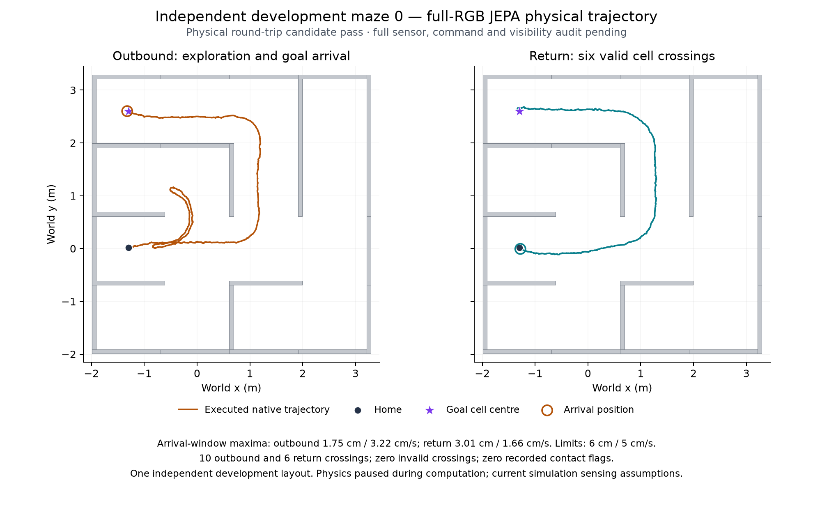

# Independent layout 0 JEPA physical round-trip candidate pass

The first independent-maze run with the fixed full-RGB JEPA predictor completed
collection and passes the existing physical round-trip evaluator. Its full raw
sensor, command and visibility audit is still running. `verified_round_trip`
remains false pending that audit.

The plot uses the closed native positions at 20 ms display intervals and the
existing evaluator-only wall geometry. It does not supply a route to the
controller. An SVG version is saved alongside it. The plotting source is
`scripts/plot_independent_layout00_jepa_physical_trace_development.py`.

| Arrival | Decision | Maximum distance during required second | Maximum speed during required second | Physical dwell |
| --- | ---: | ---: | ---: | --- |
| Outbound | 2061 | 0.01754423 m | 0.03215606 m/s | Pass |
| Return | 3439 | 0.03014707 m | 0.01661702 m/s | Pass |

The unchanged limits are 0.06 m and 0.05 m/s throughout the one-second arrival
window, with zero requested commands. The separate terminal quiet window passes.
There are ten outbound and six return cell crossings, all through declared open
edges. The return follows the reverse of the loop-erased outbound route. All
sampled positions remain in the maze and both native step bounds pass.
The 173,200-sample physical trace contains zero recorded contact flags.
No physical or acquisition stop occurred.

| Phase | Elapsed simulation time | Native XY travel |
| --- | ---: | ---: |
| Outbound | 206.1 s | 11.7378 m |
| Return | 137.8 s | 8.1079 m |

Travel sums consecutive 2 ms native XY displacements, including lateral gait
motion. It is not a shortest-path efficiency score. The return is shorter, but
this phase comparison does not isolate persistent memory: the outbound and
return missions have different observation histories and exploration needs.

Collection recorded 3,450 decisions, ending with ten terminal zero ticks. The
sampled collection resource limits passed without a breach. Collection resource
timestamps span approximately 51.06 minutes; the full audit is additional time.
Across all 3,450 recorded acquisition-plus-controller intervals, the median is
770.98 ms, p95 is 1,351.32 ms, and maximum is 1,753.13 ms. Every interval exceeds
100 ms. These intervals exclude intervening persistence and other iteration
overhead, so they do not overstate the complete loop's timing limitation.

The companion JSON preserves the original collection result, complete evaluator
output and SHA-256/byte identities of the closed collection and physical trace.
Evaluation used the existing independent pipeline's 8,000-decision evaluator;
no arrival was relabeled, no limit changed, and no controller replay or native
simulation was added for this readout. Numerical evaluation and the two closed
artifact hashes took approximately 0.33 seconds after imports.

The fixed model is `seed_2026091001_full_jepa`, corrected state SHA-256
`35496b6b402013f7a33d9c30110e115b90ded672f0d0da829a07128601507b6a`.
This is one independent development maze. The reactive, supervised-rollout,
direct and nominal-forecast controls remain queued on the same maze; their
results cannot yet establish any comparative advantage. Further independent
layouts and the prediction/memory comparisons remain necessary. Physics pauses
during computation and sensing retains the current simulation assumptions, so
this provides neither real-time qualification nor hardware evidence.
