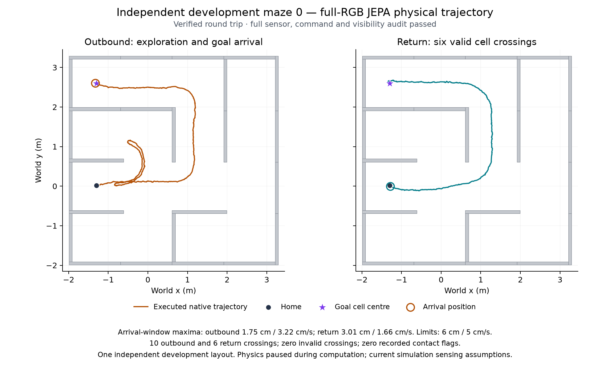

# Verified JEPA round trip on independent development maze 0

The full-RGB JEPA controller completed the first fixed independent development
maze and returned home. The final runner result is
`STOP_CONDITIONED_INDEPENDENT_CASE_COMPLETE` with `verified_round_trip: true`.
The process exited successfully. Raw sensor reconstruction, auxiliary RGB
reconstruction, complete model/command replay, command audit, unchanged model
state and strict physical visibility all pass. There are no hard measurement
failure frames, physical stops or acquisition stops.

The plot uses the closed native trace and evaluator-only wall geometry; an SVG
version is saved alongside it. The plot did not supply a route to the controller.

| Arrival | Decision | Maximum distance during required second | Maximum speed during required second |
| --- | ---: | ---: | ---: |
| Outbound | 2061 | 1.7544 cm | 3.2156 cm/s |
| Return | 3439 | 3.0147 cm | 1.6617 cm/s |

Both unchanged arrival windows pass the 6 cm / 5 cm/s limits under zero
requested commands. The separate terminal quiet window passes. The 173,200
native physics samples contain zero recorded contact flags. Ten outbound and
six return cell crossings are all valid; the return follows the reverse of the
loop-erased outbound route. All sampled positions remain in the maze.

Outbound travel is 11.7378 m over 206.1 simulated seconds; return travel is
8.1079 m over 137.8 seconds. Travel sums consecutive native XY displacements
at 2 ms resolution, including gait motion. This is not a shortest-path score
or an isolated estimate of a memory effect.

The fixed predictor is `seed_2026091001_full_jepa`, training seed 2026091001,
corrected state SHA-256
`35496b6b402013f7a33d9c30110e115b90ded672f0d0da829a07128601507b6a`.
The companion JSON records final audit fields, physical evidence, resources and
identities of the final result, launch, audit and readout. Final result SHA-256:
`e8a5c5e957c76911ec0f3e968ab9d2c22070bfd5b2706edaf0cfaf39b3e78bea`.
The final runner's collection/trace bindings agree with the earlier physical
readout. The original preliminary report remains available as a historical
record of what was known before audit completion.

Collection took 51.06 minutes; total execution including audit took 101.50
minutes. Both phases completed without a sampled resource breach. The final
audit reports observation-plus-control median 771.36 ms and p95 1,351.71 ms;
iteration including the receipt has median 823.75 ms and p95 1,406.59 ms.
All 3,450 intervals exceed 100 ms under either measure. These final audit
intervals differ slightly from the narrower resource-stage intervals in the
preliminary report.

The reactive case automatically started afterward on the same maze with the
same 8,000-decision budget and no high-level model. Its live owner is PID
3140904, creation time 1789257654.51, session 74530. Supervised-rollout, direct
and nominal-forecast cases remain serially queued. No comparative advantage is
established yet. All five cases concern one independent maze replicate.

This is one verified independent-maze simulation result. Further layouts,
training/planning/memory comparisons, realistic sensing and continuous physics
during computation remain necessary. The current run pauses physics during
computation and uses the existing simulation sensing assumptions. Real-time,
hardware, navigation qualification and overall goal completion remain false.
