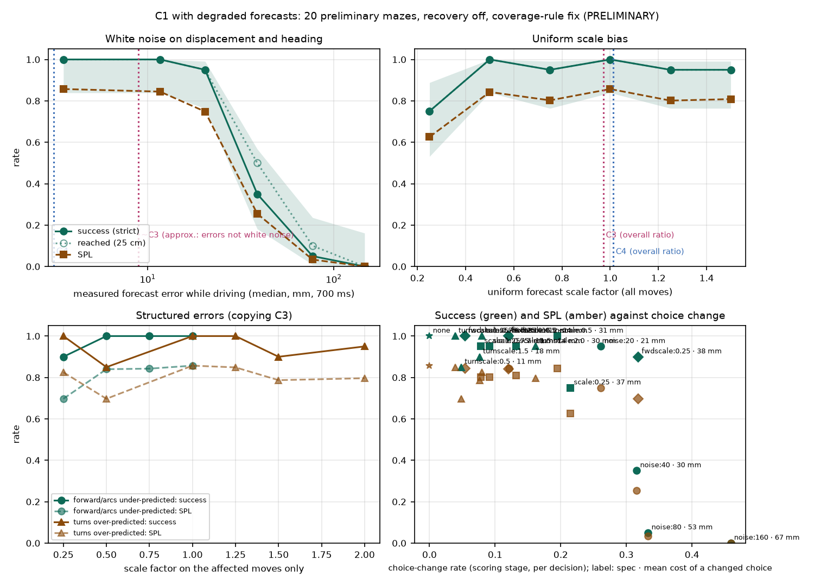

# Forecast sensitivity: how much forecast error does the harness tolerate? 2 October 2026

**PRELIMINARY.** Development mode, prelim_test_v1 mazes 30–49. C1 (command-history kinematics) drives with its forecasts deliberately degraded; everything else is unchanged. Recovery off, coverage-rule fix, V4 harness (before the reserve exit planned in [go2_navigation_harness_reserve_exit_plan_2026-10-02.md](go2_navigation_harness_reserve_exit_plan_2026-10-02.md)). 19 cohorts × 20 missions = 380 missions, all complete. Full tables: [go2_navigation_forecast_sensitivity_tables_2026-10-02.md](go2_navigation_forecast_sensitivity_tables_2026-10-02.md).

## Answer

- **Random forecast error: the cliff is between 20 and 40 mm** (median 700-ms error while driving). 10 mm costs nothing (20/20). 20 mm costs one maze and 48 s per round trip (19/20). 40 mm drops to 7/20, 80 mm to 1/20, 160 mm to 0/20.
- **Consistent bias is tolerated far better than noise.** Every forecast scaled by 0.5 is 56 mm off at the median, yet drives 20/20. Scaling by 1.25 or 1.5 gives 19/20. Only 0.25 hurts (15/20).
- **Bad forecasts make the robot freeze, not crash.** 0 contacts and 0 clearance violations in all 380 missions. The last-moment depth stop caught 18 planned translations in total; none would have become a contact or violation without it.
- **The freezes are almost all the shared reserve trap.** 45 of the 50 stalls had the robot inside the 0.48-m reserve with no translation allowed out.
  - **This curve's cliff was mostly reserve-trap stalls:** 6 of 13 failures at 40 mm, 14 of 19 at 80 mm and 14 of 20 at 160 mm. The rest were tracker losses, unconfirmed arrivals and a few other stalls.
  - The tolerance measured here is therefore largely a property of the V4 clearance rule. It is re-measured on the next harness version (trimmed: clean, noise 20/40/80 mm, forward/arcs × 0.25).
- **C1, C3 and C4 all sit well inside the tolerance on nominal dynamics:** 6, 10 and 5 mm, with ratios 0.96–1.01. On this harness their accuracy differences cannot show up as driving differences. A discriminating test has to push C1's error past about 20 mm, or its bias outside about 0.5–1.5×.

## Setup

**Degradations** (applied to C1's forecast for every candidate move before scoring and clearance checks; the robot's commands and physics are untouched):
- **White noise** on predicted displacement and heading: 10, 20, 40, 80, 160 mm.
- **Uniform scale** on every move: 0.25, 0.5, 0.75, 1.25, 1.5.
- **Structured errors copying C3's pattern:** forward and arcs under-predicted (× 0.25, 0.5, 0.75); turns scaled (× 0.25, 0.5, 1.25, 1.5, 2.0). The turns-only under-prediction cohorts had a [prediction written before results](go2_navigation_turn_underprediction_prediction_2026-10-02.md).

**Measures.**
- **Measured forecast error:** the selected move's 700-ms forecast against physics truth while driving (median error · median predicted/true ratio), the same measure used for C3 and C4 in the preliminary run.
- **Strict success:** the frozen arrival rule. **Reached:** the true base came within 0.25 m of the beacon and then of home.
- **Pose loss** (the visual tracker failed) is a shared-system failure, not a forecast failure, and is counted separately.
- **Choice change and its cost:** the share of decisions where the degraded forecast picked a different move. Cost = the clean-forecast score of the clean choice minus that of the degraded choice. The recomputation reproduces the logged degraded utilities to within 8.3e-07 m.

## Dose-response (C1, mazes 30–49)

| Condition | Measured error · ratio | Strict success | Reached | Pose loss | SPL | Median round trip (s) | Choice change · mean cost (mm) | vs clean: success diff (95% CI) | vs clean: time (s) |
|---|---|---|---|---:|---:|---:|---|---|---|
| clean | 6 mm · 0.96 | 20/20 | 20/20 | 0 | 0.86 | 155 | 0 · – | – | – |
| noise 10 mm | 12 mm · 0.97 | 20/20 | 20/20 | 0 | 0.84 | 159 | 0.12 · 12 | +0.00 | +11.5 (−1.1 to +30.8) |
| noise 20 mm | 20 mm · 1.02 | 19/20 | 19/20 | 0 | 0.75 | 191 | 0.26 · 21 | −0.05 (−0.15 to 0.00) | +47.9 (+26.5 to +70.9) |
| noise 40 mm | 39 mm · 1.38 | **7/20** | 10/20 | 3 | 0.25 | 309 | 0.32 · 30 | **−0.65 (−0.85 to −0.45)** | +124 |
| noise 80 mm | 77 mm · 2.38 | **1/20** | 2/20 | 3 | 0.03 | 308 | 0.33 · 53 | −0.95 | +138 |
| noise 160 mm | 147 mm · 8.03 | **0/20** | 0/20 | 2 | 0.00 | – | 0.46 · 67 | −1.00 | – |
| scale × 0.25 | 7 mm · 0.23 | 15/20 | 15/20 | 0 | 0.63 | 171 | 0.22 · 37 | −0.25 (−0.45 to −0.10) | +13.4 (+1.9 to +24.8) |
| scale × 0.5 | 56 mm · 0.47 | 20/20 | 20/20 | 0 | 0.84 | 164 | 0.20 · 31 | +0.00 | +14.4 (+1.6 to +28.3) |
| scale × 0.75 | 26 mm · 0.71 | 19/20 | 19/20 | 0 | 0.80 | 168 | 0.09 · 11 | −0.05 | +12.6 |
| scale × 1.25 | 18 mm · 1.19 | 19/20 | 19/20 | 1 | 0.80 | 171 | 0.08 · 8 | −0.05 | +13.3 |
| scale × 1.5 | 35 mm · 1.43 | 19/20 | 19/20 | 0 | 0.81 | 162 | 0.13 · 14 | −0.05 | +17.8 |
| forward/arcs × 0.25 | 12 mm · 0.50 | 18/20 | 18/20 | 1 | 0.70 | 229 | 0.32 · 38 | −0.10 (−0.25 to 0.00) | +98.5 (+75.5 to +125.8) |
| forward/arcs × 0.5 | 57 mm · 0.49 | 20/20 | 20/20 | 0 | 0.84 | 165 | 0.12 · 24 | +0.00 | +6.0 |
| forward/arcs × 0.75 | 30 mm · 0.73 | 20/20 | 20/20 | 0 | 0.84 | 167 | 0.05 · 13 | +0.00 | +9.4 |
| turns × 0.25 | 7 mm · 0.95 | 20/20 | 20/20 | 0 | 0.82 | 161 | 0.08 · 16 | +0.00 | +9.9 |
| turns × 0.5 | 6 mm · 0.94 | 17/20 | 17/20 | 2 | 0.70 | 160 | 0.05 · 11 | −0.15 (−0.30 to 0.00) | +23.1 (+8.4 to +40.7) |
| turns × 1.25 | 6 mm · 0.97 | 20/20 | 20/20 | 0 | 0.85 | 162 | 0.04 · 6 | +0.00 | +14.3 |
| turns × 1.5 | 6 mm · 0.98 | 18/20 | 18/20 | 0 | 0.79 | 162 | 0.08 · 18 | −0.10 (−0.25 to 0.00) | +5.5 |
| turns × 2.0 | 9 mm · 1.04 | 19/20 | 19/20 | 0 | 0.80 | 180 | 0.16 · 30 | −0.05 | +36.7 (+23.6 to +50.2) |

Wilson intervals, SPL and time intervals, hold rates and p95 change costs are in the full tables. The measured error of the scale cohorts is a poor axis on its own: × 0.5 is 56 mm off and costs nothing, while noise at 39 mm collapses. What matters is the error's type. A consistent bias keeps the order of the moves, so most changed choices are near-ties: at × 0.5, 20% of choices change at a mean cost of 31 mm, with no loss. Noise reshuffles the moves and also makes the forecast paths jagged, which fails the clearance check.

**Reference, measured the same way while driving in the preliminary recovery-off run:** C1 6 mm · 0.96; C3 10 mm · 0.97; C4 5 mm · 1.01. C3's errors are structured (forward/arcs under-predicted, turns over-predicted), not white noise. The structured cohorts copy that pattern, and driving held to forward × 0.5 and turns × 1.25 with no loss.

## How it fails: freeze, not crash

| Condition | Forecast-attributable failures: holding · turning in place · wandering · progressing | Of those, ended at the target | Time share: progressing · holding · turning in place | Moves rejected by the forecast clearance check per decision (of 5) · all 5 rejected | Share of planner holds caused by forecast clearance |
|---|---|---:|---|---|---:|
| clean | 0 · 0 · 0 · 0 | – | 0.96 · 0.00 · 0.00 | 0.04 · 0.00 | 0.01 |
| noise 20 mm | 1 · 0 · 0 · 0 | 0/1 | 0.72 · 0.10 · 0.11 | 0.60 · 0.10 | 0.69 |
| noise 40 mm | 6 · 3 · 0 · 1 | 5/10 | 0.36 · 0.33 · 0.24 | 2.10 · 0.34 | 0.85 |
| noise 80 mm | 14 · 1 · 0 · 1 | 2/16 | 0.24 · 0.56 · 0.16 | 3.52 · 0.59 | 0.92 |
| noise 160 mm | 13 · 3 · 0 · 2 | 0/18 | 0.11 · 0.41 · 0.45 | 3.68 · 0.47 | 0.92 |
| scale × 0.25 | 4 · 0 · 0 · 1 | 0/5 | 0.55 · 0.41 · 0.02 | 2.15 · 0.43 | 0.99 |

- **No wandering.** Under bad forecasts the robot does not drive off in wrong directions. The forecast clearance check rejects most moves, the robot holds or turns, and the mission runs out of time.
- **Arrival confirmation also fails under noise.** At 40 mm, 5 of the 10 forecast-attributable failures ended within 0.25 m of their active target without the arrival rule confirming it:
  - three turned in place there for 296–375 s: terminal heading settling under noisy heading forecasts (trap 2 in the [known limitations](go2_navigation_harness_v4_known_limitations_2026-09-29.md));
  - one held there for 390 s, a reserve-trap stall;
  - one was still settling when time ran out.
- **Strict and reached differ only at noise 40 and 80 mm** (7 against 10, and 1 against 2). Reached needs both targets, and most at-target failures stopped at the beacon.
- **Pose loss: 12 missions, all after turning-dominated motion.** It is a shared-system failure, and the tracker limitation was updated with the four losses from the last cohorts. The tracker never sees the forecast; degraded forecasts cause the loss only by producing long in-place turning.

## The freezes are the reserve trap

`scripts/analyse_go2_reserve_trap_development.py`, sampled every 5 s inside each stall of at least 120 s without translation. Every stall was in a failed mission. For the noise cohorts, the logged (noisy) forecast clearances cannot tell where the robot really was, so the true centre clearance is used. "Inside the reserve" means within 0.495 m of a true wall, which is the remembered 0.48 m plus the map's measured 1.5-cm bias. For the deterministic cohorts the logged labels are used.

| Condition | Stalls | Reserve trap | Of those, inside the 0.45-m disc | Onset true centre clearance, median (range) | Not the trap |
|---|---:|---:|---:|---|---|
| noise 20 mm | 1 | 1 | 1 | 0.549 m | – |
| noise 40 mm | 6 | 6 | 6 | 0.499 (0.472–0.578) | – |
| noise 80 mm | 14 | 14 | 12 | 0.465 (0.446–0.523) | – |
| noise 160 mm | 16 | 14 | 11 | 0.512 (0.465–0.574) | 37, 39: true centre 0.50–0.57 m; the noisy forecast alone blocked translation (37 also scanning) |
| scale × 0.25 | 5 | 5 | 0 | 0.525 (0.484–0.604) | – |
| scale × 0.75, × 1.5 | 2 | 2 | 1 | 0.473, 0.507 | – |
| turns × 1.5, × 2.0 | 3 | 3 | 1 | 0.486–0.509 | – |
| forward/arcs × 0.25 | 1 | 0 | – | 0.526 | 42: translations passed the check but were not selected; it resumed at 340 s |
| turns × 0.5 | 2 | 0 | – | 0.488, 0.524 | 42: hold outscored every clear translation at the reserve edge, as in stage-2 C1 maze 45; 32: ended by pose loss |
| **All** | **50** | **45** | **32** | | |

**Reading.**
- Degraded forecasts make the planner reject moves and hold or turn far more often. At 40 mm noise, 2.1 of 5 moves are rejected per decision on average, against 0.04 clean.
- Turning drifts the body 5–7 cm, and holding near walls lets that drift accumulate, so the robot ends inside the reserve. There the V4 rule allows no translation out, and the stall becomes permanent.
- The same trap explains C2's recovery-off stalls, C3's maze-31 deadlock in the preliminary run and 8 of the 13 stage-2 C1 stalls ([margin results](go2_navigation_calibrated_margin_results_2026-10-02.md)).
- **Expectation for the next harness version, to be measured rather than assumed.** Its exit allows a translation only if the forecast clearance never decreases (1-mm tolerance) and ends higher.
  - Under-prediction keeps forecast paths smooth, so the scale × 0.25 freezes may clear once the robot has turned away from the wall.
  - Noisy forecast paths will rarely pass a 1-mm monotonicity test, so the noise cliff is likely to remain, though it may move.

## Safety

| Condition | Contacts | Hard · operating violations | Separation, whole mission: worst · p5 · median (cm) | Separation while translating: worst · p5 (cm) | Depth stops on planned translations · would-be contact or violation without the stop |
|---|---:|---|---|---|---|
| clean | 0 | 0 · 0 | 7.5 · 18.6 · 31.5 | 10.8 · 24.6 | 0 · 0 |
| noise 40 mm | 0 | 0 · 0 | 3.9 · 8.7 · 22.6 | 8.4 · 19.2 | 1 · 0 |
| noise 80 mm | 0 | 0 · 0 | 4.9 · 9.3 · 20.6 | 7.7 · 17.7 | 3 · 0 |
| noise 160 mm | 0 | 0 · 0 | 4.2 · 7.5 · 22.1 | 6.1 · 14.8 | 4 · 0 |
| scale × 0.25 | 0 | 0 · 0 | 7.4 · 14.7 · 26.7 | 8.8 · 23.0 | 1 · 0 |
| scale × 0.5 | 0 | 0 · 0 | 5.1 · 17.5 · 30.5 | 7.1 · 23.5 | 0 · 0 |
| forward/arcs × 0.25 | 0 | 0 · 0 | 6.1 · 17.9 · 30.7 | 8.8 · 23.0 | 9 · 0 |

- **No cohort had a contact or a violation.** The lowest separations under noise come from stalled robots turning beside walls, not from driving into them.
- **The depth stop was not what kept these runs safe.** Of its 18 catches on planned translations, the worst would-be separation without the stop was 10.7 cm. Safety came from the planner-stage checks. Under-prediction at × 0.25 and × 0.5 is the explicit safety test, and it is written as an error budget in [go2_navigation_forecast_sensitivity_safety_budget_2026-10-02.md](go2_navigation_forecast_sensitivity_safety_budget_2026-10-02.md): every close approach sits at or above its bound.
- **Clearance loss outside the cameras' view** (rear calves during turns) is recorded there and in the known limitations; the physical Go2's wide-view lidar would cover it.

## What this means for the dynamics experiment

The [dynamics plan](go2_navigation_dynamics_perturbation_plan_2026-10-02.md) picks perturbation levels from this curve.
- **Friction, payload and weaker motors make the robot move less than commanded.** C1, which predicts nominal motion, then over-predicts: its predicted/true ratio is commanded/realised.
- **Over-prediction was tolerated to the limits tested:** uniform × 1.5 gave 19/20 and turns × 2.0 gave 19/20. Nothing beyond × 1.5 on all moves was run.
- **Random slip adds noise-like error.** The cliff for that is 20–40 mm.

The plan is updated accordingly:
- Characterisation keeps levels where C1's open-loop error passes these thresholds.
- Two over-prediction cohorts (uniform × 2.0 and × 3.0) cover the side of the curve friction actually lands on.
- Because 45 of 50 freezes were the trap, the curve's key points are re-measured on the next harness version before any level is chosen.

## Caveats

- One controller (C1), one seed per maze, 20 mazes per cohort. Most single-cohort differences of 1–2 mazes are inside the interval.
- **Degradations are synthetic.** White noise is independent per step; real prediction error is correlated in time and with the scene.
- **The "measured error" axis mixes error types.** Compare bias against bias and noise against noise.
- **The tolerance is the V4 harness's.** Its clearance rule (0.45-m disc, 0.48-m requirement, the reserve trap) shapes the curve. This is not yet a property of navigation in general.
- **Provenance.** Cohorts launched after the pinned-launch process began carry a launch pin (noise 80 mm `6a83b937`, scale × 0.75 `5fb0e09a`, turns × 2.0 `6c679907`); earlier ones ran from the live tree. Three missions crashed by the 6be6d83a import incident were re-run with `scripts/repair_go2_dev_cohort_import_failures_development.py`; the originals are kept as `result.import_failure_original.json`.

## Sources

- **Cohorts:** `dev_cohorts/sens_*` under the capability root; runs under `runs/`.
- **Scripts:**
  - `scripts/report_go2_forecast_sensitivity_development.py` (dose-response, choice change, plot);
  - `scripts/diagnose_go2_forecast_sensitivity_failures_development.py` (mechanism, safety, filters, catches);
  - `scripts/analyse_go2_reserve_trap_development.py` (stalls);
  - `scripts/analyse_go2_forecast_sensitivity_close_approaches_development.py` and `scripts/analyse_go2_forecast_sensitivity_error_budget_development.py` (safety budget).
