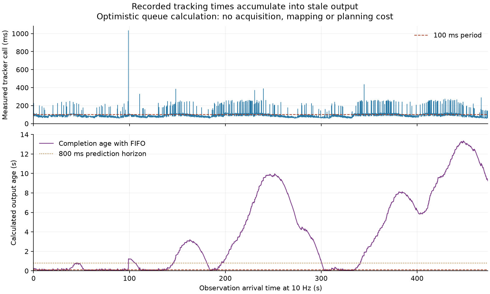

# Why a separate FIFO tracker worker is insufficient

The completed sampled-tracker run averaged 97.274 ms per observation, just
below a 100 ms arrival period. Its bursts of slower calls nevertheless produce
substantial backlog when processed by one worker in arrival order.

The calculation uses all 4,740 recorded call durations in their original
order. Observations arrive exactly every 100 ms. Each call starts at the later
of its arrival and the preceding call's completion. No acquisition, mapping,
planning, serialization or actuator cost is added, and no observations are
dropped. These are optimistic scheduling assumptions, not a continuous native
experiment or a simulation of delayed navigation behavior.

| Calculated output age | Result |
| --- | ---: |
| Median | 2.229 s |
| Maximum | 13.342 s, at frame 4483 |
| Final observation | 9.229 s |
| Older than 100 ms at completion | 3,642 / 4,740 |
| Older than 800 ms at completion | 2,807 / 4,740 |
| Older than 1 s at completion | 2,715 / 4,740 |

At the peak, 13.149 seconds is queue waiting and 0.193 seconds is the current
tracker call. The resulting age can therefore exceed the current planner's
entire 800 ms forecast horizon even when the current call itself is relatively
short. The isolated-call deadline count of 1,615 understates the freshness
problem once preceding work is allowed to queue.

This rules out treating a straightforward FIFO worker split as sufficient
evidence of continuous execution. The current tracker/controller expects
uninterrupted 100 ms observations, so discarding queued frames also requires
an explicit change to timestamp, motion-estimation and history handling.
The next execution design must handle stale observations and command age,
then demonstrate behavior with physics advancing during computation.
No support for skipped observations, continuous commands or deadline fallback
has been established by this calculation.

The durations were measured on a shared host. Reusing them does not predict
exact timing after a scheduling or architecture change. No output-age value
here is a measured age from a running asynchronous controller.

Reproduction source: `scripts/analyze_sampled_tracker_fifo_timing_development.py`.
The numerical results, assumptions and input file identities are in
`go2_sampled_tracker_fifo_timing_2026-09-13.json`; the plot is also available as
`go2_sampled_tracker_fifo_timing_2026-09-13.svg`. The source tracker result SHA-256
is `adc5e27923ebe25464fd3b57d373b7a21130c726b192881bf2c5202ca83e4910`.
No native run or queued comparison was changed.
