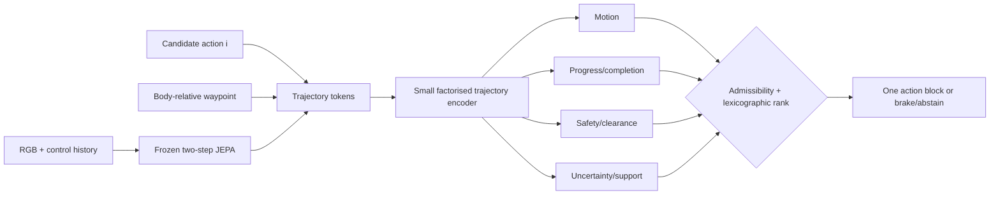

# FACTORISED_RISK_CONSTRAINED_TRAJECTORY_RANKER

## Design principle

The planner must not turn an unsafe high-progress prediction into a selectable action. Geometry, progress, safety, completion, and epistemic support are separate outputs and separate gates.

## Recommended size

Use per-token input projections 1024→256, candidate/action and horizon embeddings at width 256, a 2-layer 4-head transformer encoder (≈0.8–1.5M trainable parameters depending on query implementation), and five learned queries (motion, progress, safety, completion, uncertainty). Keep the V-JEPA encoder and predictor fully frozen. The expected activation footprint is well below the predictor; target <2 GB incremental VRAM at 12 candidates and H1–H3, but measure before training.

Do not globally mean-pool before learned operations. Reduce only after cross-token interaction, preserving spatial tokens, explicit horizon embeddings, candidate identity, and the waypoint token.

## Heads

Motion predicts `(dx,dy,sin(dyaw),cos(dyaw))` at H1–H3. Progress predicts remaining distance, distance reduction, completion probability, and time-to-reach. Safety predicts per-horizon and path aggregate contact/collision, low-clearance, stuck, fall, and stop-failure probabilities. Uncertainty predicts calibrated residual width or a support score from ensemble disagreement, training-support distance, horizon disagreement, and residual calibration.

## Candidate rule

1. Reject calibrated safety risk above the frozen limit, low predicted clearance, unsupported trajectories, or the runtime safety veto.
2. If none remains, brake/hold and record abstention.
3. Among admissible candidates, minimise the lower confidence bound of remaining waypoint distance.
4. Maximise completion probability, then lower-confidence-bound progress.
5. Minimise uncertainty, then unnecessary control variation, then candidate index.

This lexicographic rule is compared with one pre-specified scalar-cost baseline; no post-hoc weights are tuned.

## Objectives

Fit geometry with robust regression and qualify it independently. Fit safety with per-horizon/path labels and calibrate on scene-disjoint data. Fit progress with same-state pairwise/listwise ordering, preferring safe over unsafe and then greater progress/earlier completion. The planner is not an unconstrained utility scorer.

## Baselines and upper bounds

B0 hold/brake; B1 action-only kinematic prior; B2 endpoint latent distance only when a fair local goal image exists; B3 frozen one-step; B4 frozen two-step; B5 true-future planner; B6 realised oracle candidate. B5 separates planner adequacy from world-model error; B6 is evaluation-only.

## Failure handling

Geometry failure stops the pipeline before predicted-latent claims. Safety calibration failure prevents closed-loop progression. If all candidates are unsafe or unsupported, the correct output is brake/abstain, not a least-unsafe action.
